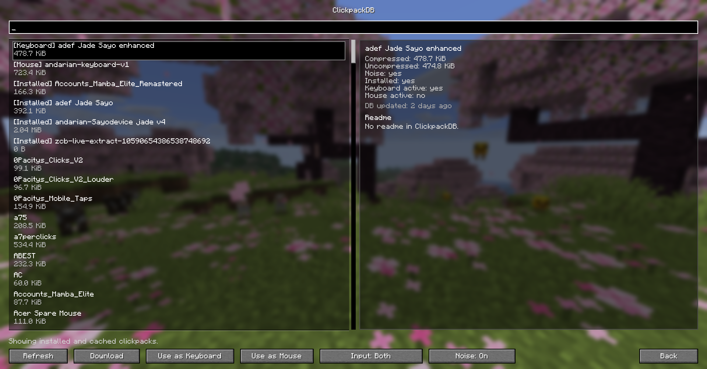
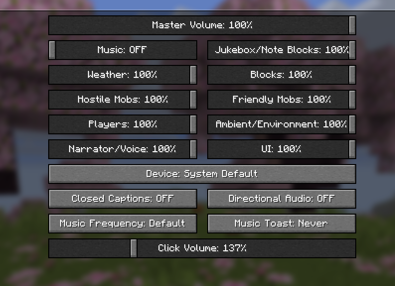

# ZCB Live for Minecraft

ZCB Live had a long history of being a [Geometry Dash only mod](https://geode-sdk.org/mods/zeozeozeo.zcblive). Today we are expanding the horizons of what's possible with Minecraft modding, and bringing the untamed power of ZCB Live to Minecraft!

ZCB Live is a next-generation Minecraft clickbot. What it does is replicate the sound of a mouse and keyboard in the most realistic manner possible. Whether you're recording intense PvP matches, filming Bedwars highlights, or just playing casually, ZCB is designed to deliver an unforgettable Minecraft experience.

## Features

* Incredibly easy to use
* [ClickpackDB](https://zeozeozeo.github.io/clickpack-db) integration: download more than 800 clickpacks without ever leaving the game. We owe the Geometry Dash community for this one.
* Realistic click sound algorithm: pitch variation, volume changes, softclick/microclick/hardclick timings
* Keyboard timing can be tracked per row or per hand, with per-row as the default

## Minecraft clickpacks

ZCB Live supports the GD `player1` / `player2` / `*clicks` / `*releases` layout and an optional new Minecraft format:

```text
pack/
  player1/ # can also be `clicks`, `softclicks`, ... for mouse only
  player2/ # can also be `releases`, `softreleases`, ... for mouse only
  keyboard/
    row1/
    row2/
    row3/
    row4/
    special/
      spacebar/
      backspace/
      enter/
      tab/
      modifiers/
      navigation/
      function/
      numpad/
      other/ # fallback for special keys if the corresponding folder above is not present
  mouse/
    side/ # fallback for side keys if the corresponding folder below is not present
    side4/
    side5/
```

Each of the new Minecraft folders use the same softclicks/microclicks/clicks folder structure under the hood, except hardclicks/hardreleases are ignored. You don't have to fill all the folders, for missing folders inside the `mouse` and `keyboard/special` folders the clickbot will first choose fallback sounds from `mouse/side` or `keyboard/special/other` -> if that is also missing fallback sounds are for regular mouse clicks or keyboard 

## Screenshots




## Discord

Join the Discord server for support on ZCB and a way to create and submit your own clickpacks: https://discord.gg/BRVVVzxESu
